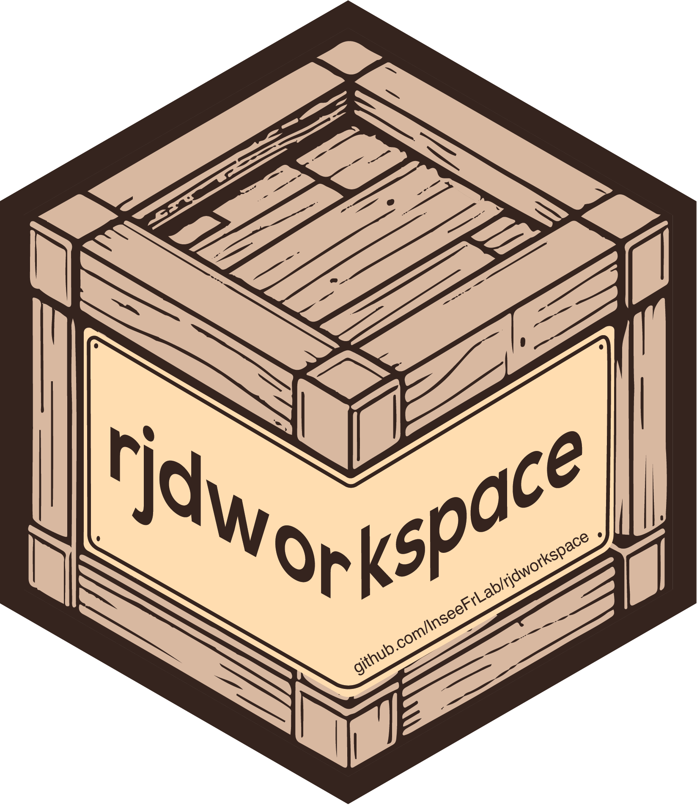

<!-- README.md is generated from README.Rmd. Please edit that file -->

# `{rjdworkspace}` <a href="https://inseefrlab.github.io/rjdworkspace/"></a>

<!-- badges: start -->

[](https://cran.r-project.org/package=rjdworkspace)
[](https://github.com/InseeFrLab/rjdworkspace/actions/workflows/lint.yaml)
[](https://github.com/InseeFrLab/rjdworkspace/actions/workflows/R-CMD-check.yaml)
<!-- badges: end -->

## Français 🇫🇷

### Présentation

`{rjdworkspace}` propose un ensemble d’outils pour manipuler les
workspaces de `JDemetra+`. Ce package utilise les archives .jar Java de
[`RJDemetra`](https://github.com/rjdverse/rjdemetra) en y ajoutant
certaines fonctionnalités. En particulier, `{rjdworkspace}` permet de :

- mettre à jour toutes les metadata d’un workspace avec celles d’un
  autre (`update_metadata()`, `update_metadata_roughly()`) ou mettre à
  jour les metadata d’un SaItem avec les metadata d’un autre SaItem
  (`set_metadata()`)
- remplacer, supprimer ou ajouter des séries à un workspace
  (`remove_sa_item()`, `remove_all_sa_item()`, `replace_sa_item()`,
  `replace_series()`, `add_new_sa_item()`)
- copier / coller des séries d’un workspace à un autre
  (`transfer_series()`)
- récupérer et modifier les commentaires d’un SaItem (`get_comment()`,
  `set_comment()`)
- définir les spécifications d’un modèle contenu dans un SaItem
  (`set_spec()`).

### Installation

`{rjdworkspace}` s’appuie sur
[`RJDemetra`](https://github.com/rjdverse/rjdemetra) qui nécessite Java
SE 8 ou une version ultérieure.

**🎉 `{rjdworkspace}` est maintenant disponible sur le CRAN ! 🎉**

Pour installer, il suffit de lancer la ligne de code suivante :

``` r
install.packages("rjdworkspace")
```

Pour obtenir la version en cours de développement depuis GitHub :

``` r
# Si le package remotes n'est pas installé
# install.packages("remotes")

# Installer la version en cours de développement depuis GitHub
remotes::install_github("InseeFrLab/rjdworkspace")
```

### Autres informations

Pour une description plus complète des packages R pour JDemetra+ voir le
document de travail Insee [Les packages R pour JDemetra+ : une aide à la
désaisonnalisation](https://www.insee.fr/fr/statistiques/5019786)

## English 🇬🇧

### Overview

`{rjdworkspace}` provides a set of tools designed to manipulate
`JDemetra+` workspaces. It depends on the .jar files of
[`RJDemetra`](https://github.com/rjdverse/rjdemetra) and extends some
functions. In particular, `{rjdworkspace}` allows to:

- update all metadata of a workspace with those contained in another one
  (`update_metadata()`, `update_metadata_roughly()`) or update the
  metadata of a SaItem with the metadata contained in another SaItem
  (`set_metadata()`) ;  
- replace, remove or add series in a workspace (`remove_sa_item()`,
  `remove_all_sa_item()`, `replace_sa_item()`, `replace_series()`,
  `add_new_sa_item()`);  
- copy&paste series from a workspace to another one
  (`transfer_series()`)
- get and set the comment of a SaItem (`get_comment()`,
  `set_comment()`);
- set the specification of a model contained in a SaItem (`set_spec()`).

### Installation

`{rjdworkspace}` relies on
[`RJDemetra`](https://github.com/rjdverse/rjdemetra) that requires Java
SE 8 or later version.

**🎉 `{rjdworkspace}` is now available on CRAN! 🎉**

To install it, you have to launch the following command line:

``` r
install.packages("rjdworkspace")
```

To get the current development version from GitHub:

``` r
# If remotes packages is not installed
# install.packages("remotes")

# Install development version from GitHub
remotes::install_github("InseeFrLab/rjdworkspace")
```

### Autres informations

For a more comprehensive description of the R packages for JDemetra+
check the Insee working paper [R Tools for JDemetra+: Seasonal
adjustment made easier](https://www.insee.fr/en/statistiques/5019812)
